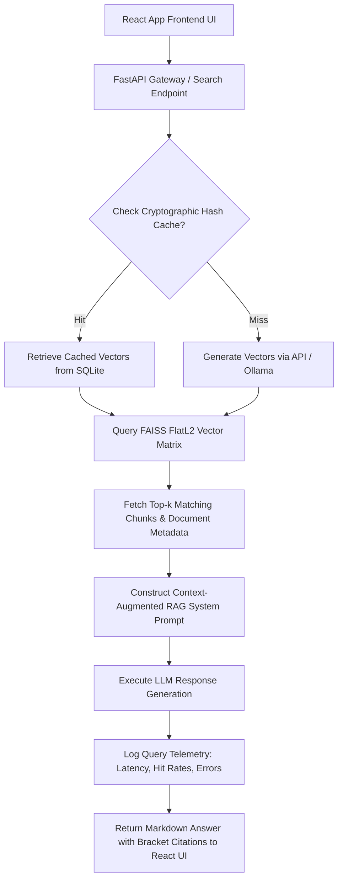
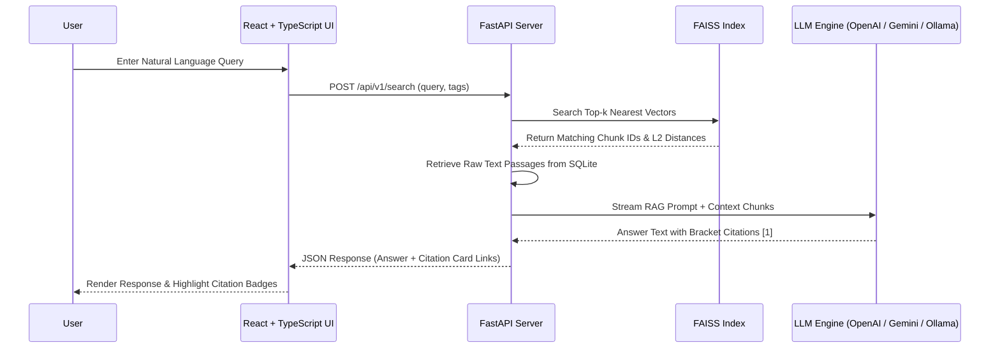

# 💎 OmniKnowledge

[](https://react.dev/)
[](https://www.typescriptlang.org/)
[](https://fastapi.tiangolo.com/)
[](https://tailwindcss.com/)
[](#-system-architecture)
[](https://www.sqlite.org/)

**OmniKnowledge** is an enterprise-grade Retrieval-Augmented Generation (RAG) knowledge assistant. Combining high-density local vector search via FAISS (`IndexFlatL2`), cryptographic embedding caching in SQLite, and dynamic prompt engineering, OmniKnowledge ingests corporate documents and delivers accurate natural-language answers with interactive inline citations.

---

## ⚡ Key Highlights

- **Dual In-Memory Embedding Cache**: Uses MD5 document chunk checksums in SQLite (`omniknowledge.db`), achieving **100% cache hits** for unchanged documents and saving API inference costs.
- **Local FAISS FlatL2 Indexing**: Serializes float matrix embeddings onto disk with custom row mapping for sub-10ms nearest-neighbor vector searches.
- **Interactive Inline Citations**: Renders clickable bracket citation badges (e.g. `[1]`, `[2]`) that dynamically highlight source document cards and reveal raw reference passages.
- **Multi-LLM Engine Compatibility**: Supports OpenAI (GPT-4o), Google Gemini, and 100% local offline execution via Ollama (Llama 3.2 + Nomic-Embed-Text).
- **Tailwind CSS v4 Glassmorphic Shell**: Responsive glassmorphic layout featuring Reader and Admin persona toggles, telemetry analytics, and CSV log exporting.

---

## 📋 Table of Contents

- [Key Highlights](#-key-highlights)
- [How the RAG Pipeline Works](#-how-the-rag-pipeline-works)
- [System Architecture](#-system-architecture)
- [Search & Generation Flow](#-search--generation-flow)
- [Setup & Execution](#-setup--execution)
- [Ollama Local Mode](#-ollama-local-mode)
- [Directory Structure](#-directory-structure)
- [License](#-license)

---

## 🧭 How the RAG Pipeline Works

1. **Ingestion & Parsing**: Markdown, JSON, and raw text files are parsed by `DocumentParser`.
2. **Semantic Overlap Chunking**: Text is segmented into 800-token chunks with 100-token overlap to maintain context across boundaries.
3. **Cryptographic Hashing**: Each chunk is assigned an MD5 hash. Cache hits reuse existing vectors from SQLite, bypassing LLM embedding API calls.
4. **Vector Matrix Search**: Chunks are indexed in a local FAISS `IndexFlatL2` matrix mapped to SQLite chunk identifiers.
5. **Contextual Q&A Generation**: Relevant chunks are injected into system prompts instructing the LLM to format answers using numbered bracket citations.

---

## 🏗️ System Architecture



---

## 📐 Search & Generation Flow



---

## 🚀 Setup & Execution

### Prerequisites

- **Python**: 3.9+ installed
- **Node.js**: v18+ & **npm** installed
- Active API Key (OpenAI / Gemini) or local Ollama installation

---

### 1. Backend Ingestion & RAG Server

```bash
# Navigate to project root
cd omni-knowledge

# Setup Python virtual environment
python3 -m venv backend/venv
source backend/venv/bin/activate
pip install -r backend/requirements.txt

# Copy environment template and set API keys
cp .env.template .env

# Run FastAPI backend server
python3 backend/main.py
```
*FastAPI server runs at `http://localhost:8000` (Interactive docs at `http://localhost:8000/docs`).*

---

### 2. Frontend React Web App

```bash
# Open new terminal and navigate to frontend
cd omni-knowledge/frontend

# Install dependencies
npm install

# Launch Vite dev server
npm run dev
```
*OmniKnowledge Web Dashboard opens at `http://localhost:5173`.*

---

## 🦙 Ollama Local Mode

To run OmniKnowledge completely locally without external API dependencies:

1. Install [Ollama](https://ollama.com/) and pull models:
   ```bash
   ollama run llama3.2
   ollama pull nomic-embed-text
   ```
2. Update `.env`:
   ```env
   LLM_PROVIDER=ollama
   OLLAMA_LLM_MODEL=llama3.2
   OLLAMA_EMBEDDING_MODEL=nomic-embed-text
   ```
3. Restart the backend server. OmniKnowledge will automatically embed and index documents locally.

---

## 📂 Directory Structure

```
omni-knowledge/
├── backend/
│   ├── main.py               # FastAPI application server entrypoint
│   ├── app/
│   │   ├── config.py         # App configuration & SQLite paths
│   │   ├── database.py       # SQLite database initialization
│   │   ├── api/              # API router packages (documents, search, metrics)
│   │   └── services/         # Document parser, chunker, embedder, FAISS vector store
│   └── data/
│       └── sample-docs/      # Default evaluation document corpus
├── frontend/
│   ├── src/
│   │   ├── components/       # Search UI, citation modal, telemetry charts
│   │   ├── hooks/            # Search & document management custom hooks
│   │   ├── pages/            # Search, Admin, and Metrics view pages
│   │   └── App.tsx           # Page router & layout wrapper
│   └── package.json
└── README.md
```

---

## 📄 License

Distributed under the MIT License. See [LICENSE](LICENSE.md) for details.
