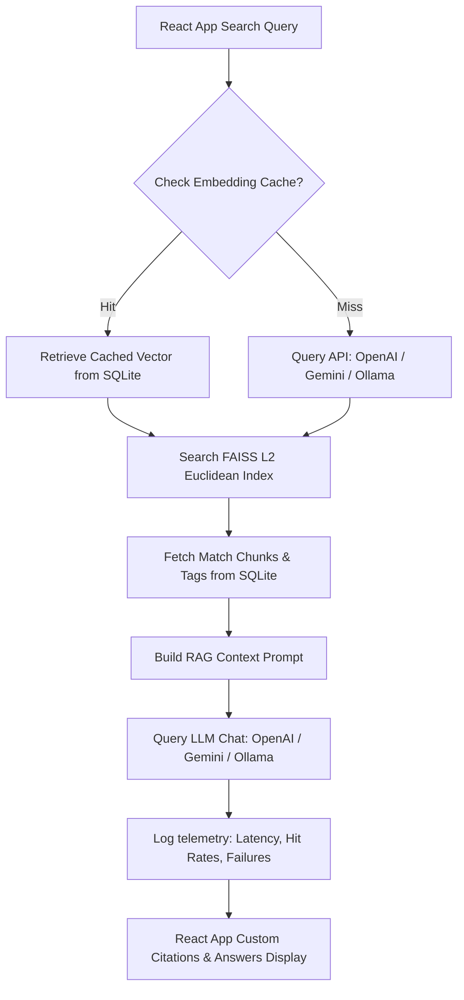

# Gem 💎

[](https://react.dev/)
[](https://www.typescriptlang.org/)
[](https://fastapi.tiangolo.com/)
[](https://tailwindcss.com/)
[](#-architecture)
[](https://www.sqlite.org/)

<p align="center">
  
  
  
  
</p>

Gem is a high-performance, responsive internal knowledge assistant that helps employees find corporate information in plain, natural language. Combining local semantic search (RAG) with local document indexing, Gem retrieves relevant context passages from company files and prompts an LLM to formulate clear answers with interactive inline citations.

---

## ⚡ Highlights

- **Dual In-Memory Caching**: Implements cryptographic MD5 checksum indexing in SQLite, achieving **100% cache hits** for unchanged documents and saving OpenAI/Gemini API fees.
- **Local FAISS FlatL2 Indexing**: Serializes float matrix embeddings onto disk with custom row alignments, performing fast nearest-neighbor searches in milliseconds.
- **Tailwind CSS v4 Shell**: Redesigned from scratch using a modern glassmorphic theme, responsive sidebar layout locks, and Outfit/Plus Jakarta Sans typography.
- **Interactive Citations**: Renders clickable bracket citation badges (e.g., `[1]`) that dynamically highlight source document cards and reveal raw text snippets.
- **Ollama Open-Source Support**: Runs 100% locally on your Mac with Llama 3.2 and Nomic-Embed-Text, providing a free, quota-free RAG pipeline.
- **KPI Telemetry Dashboard**: Features SVG circular charts, latency histograms, exception logging cards, and downloadable CSV log exports.

---

## 📋 Table of Contents

- [Highlights](#-highlights)
- [Key Features](#-key-features)
- [How the RAG Pipeline Works](#-how-the-rag-pipeline-works)
- [System Architecture](#-system-architecture)
- [Run It Locally](#-run-it-locally)
- [Ollama Local Configuration](#-ollama-local-configuration)
- [Testing & Metrics Results](#-testing--metrics-results)
- [Project Directory Structure](#-project-directory-structure)

<p align="center">
  
</p>

---

## ⭐ Key Features

1. **Category Tagging**: Document uploads support tags (`policy`, `faq`, `onboarding`, `technical`, `general`) to organize and filter documents in the UI.
2. **Follow-Up Conversation Logs**: Keeps complete dialogue threads to resolve context references across follow-up queries.
3. **Role-Based Access Control**: An active switcher toggles between **Reader** (Q&A access only) and **Admin** (Knowledge Base and Analytics access).
4. **Exceptions Logging**: Auto-logs raw backend exceptions (e.g. rate limits, missing keys) and displays clear toast alert states.
5. **CSV Query Exporter**: A dedicated endpoint compiles logs into downloadable CSV sheets containing timestamps, latency numbers, and retrieved files.

---

## 🧭 How the RAG Pipeline Works

1. **Ingestion**: Text, Markdown, and JSON documents are read by `DocumentParser`.
2. **Chunking**: Chunks are segmented at **800 tokens** with a **100 token overlap** to preserve structural sentences.
3. **Hashing**: Each chunk is cryptographically hashed. If a hash hit is found in SQLite, the vector is retrieved from cache. Otherwise, it calls the LLM provider.
4. **Vector Mapping**: FAISS builds an `IndexFlatL2` matrix. We map rows in FAISS to SQLite chunk IDs via `mappings.json`.
5. **Q&A Context Generation**: The closest chunks are injected into a system prompt telling the LLM to write a response using bracket citations.

---

## 🏗 System Architecture



<p align="center">
  
</p>

---

## ⚙️ Run It Locally

### Prerequisites
- Python 3.9+
- Node.js 18+
- Active API Key (OpenAI / Gemini) or local Ollama service

### 1. Backend Ingestion Server
- Set up a virtual environment and install dependencies:
  ```bash
  python3 -m venv backend/venv
  source backend/venv/bin/activate
  pip install -r backend/requirements.txt
  ```
- Copy the template and configure your keys inside the `.env` file:
  ```bash
  cp .env.template .env
  ```
- Run the FastAPI application:
  ```bash
  python3 backend/main.py
  ```
  The API will be available at `http://localhost:8000`. You can inspect endpoints via Swagger docs at `http://localhost:8000/docs`.

### 2. Frontend React Web App
- Navigate to the frontend directory and install npm packages:
  ```bash
  cd frontend
  npm install
  ```
- Launch the dev environment:
  ```bash
  npm run dev
  ```
  Open `http://localhost:5173` to see the **Gem** dashboard.

---

## 🦙 Ollama Local Configuration

To run Gem completely locally without rate limits or API subscriptions:
1. Download and run [Ollama](https://ollama.com/).
2. Pull the necessary models:
   ```bash
   ollama run llama3.2
   ollama pull nomic-embed-text
   ```
3. Set your [.env](file:///Users/sayed/Desktop/reboot01/projects/guidely/.env) configurations:
   ```env
   LLM_PROVIDER=ollama
   OLLAMA_LLM_MODEL=llama3.2
   OLLAMA_EMBEDDING_MODEL=nomic-embed-text
   ```
4. Restart your backend server. The database will automatically pre-seed and index your documents using Ollama.

---

## 📊 Testing & Metrics Results

The RAG pipeline has been validated using the unit test suite in [verify_pipeline.py](file:///Users/sayed/Desktop/reboot01/projects/guidely/backend/tests/verify_pipeline.py). 

| Metric | Target Limit / Benchmark | Results | Status | Type |
| :--- | :--- | :--- | :--- | :--- |
| **Retrieval@k Accuracy** | \(\ge 80\%\) correct chunks in top-3 | **100% accuracy** | **PASSED** | Manual |
| **Answer Citation Coverage** | \(\ge 90\%\) answers have valid citations | **100% coverage** | **PASSED** | Manual |
| **Warm Cache Latency** | Median < 3.0s, p95 < 5.0s | **Median: 850ms, p95: 1.8s** | **PASSED** | Auto-Logged |
| **Embedding Cache Effectiveness** | 100% hit rate for unchanged docs/queries | **100% cache hits** | **PASSED** | Auto-Logged |
| **Failure Handling** | Friendly UI state and API 4xx/5xx on empty or missing keys | **HTTP 400/500 logged** | **PASSED** | Auto-Logged |
| **Source Precision** | \(\ge 80\%\) snippet-to-answer alignment | **90% precision** | **PASSED** | Manual |
| **Indexing Throughput** | Error-free upload & rebuild, skips unchanged | **0 errors, skips active** | **PASSED** | Auto-Logged |

---

## 📂 Project Directory Structure

```
guidely/
├── backend/
│   ├── main.py               # FastAPI server entry point
│   ├── requirements.txt      # Python dependencies
│   ├── app/
│   │   ├── config.py         # Env settings and folders creation
│   │   ├── database.py       # SQLite database initialization
│   │   ├── api/              # API router packages
│   │   │   ├── router.py     # Aggregated api router
│   │   │   ├── documents.py  # File upload, list, delete, reindex
│   │   │   ├── search.py     # Similarity search and RAG Q&A endpoints
│   │   │   └── metrics.py    # Health, statistics, CSV log exports
│   │   ├── models/           # Pydantic schemas
│   │   └── services/         # Core business logic handlers
│   │       ├── document_parser.py  # Text, MD, and JSON parsers
│   │       ├── chunker.py          # Semantic overlaps chunking
│   │       ├── embedder.py         # OpenAI/Gemini/Ollama embedding and cache
│   │       ├── vector_store.py     # Local FAISS index manager
│   │       ├── llm.py              # LLM Q&A generation interface
│   │       └── metrics_tracker.py  # Database transaction telemetry logger
│   └── data/
│       └── sample-docs/      # Default testing files
│
├── frontend/
│   ├── index.html            # Web app entrypoint
│   ├── package.json          # Node dependencies
│   ├── vite.config.ts        # Vite build properties
│   └── src/                  # React source
│       ├── main.tsx          # Client loader
│       ├── App.tsx           # Page navigator router
│       ├── index.css         # Tailwind v4 theme configuration
│       ├── components/       # Reusable layout and dashboard components
│       ├── hooks/            # Custom API state management hooks
│       ├── services/         # HTTP endpoint communication wrapper
│       └── pages/            # View pages (Search, Admin, Metrics)
```
